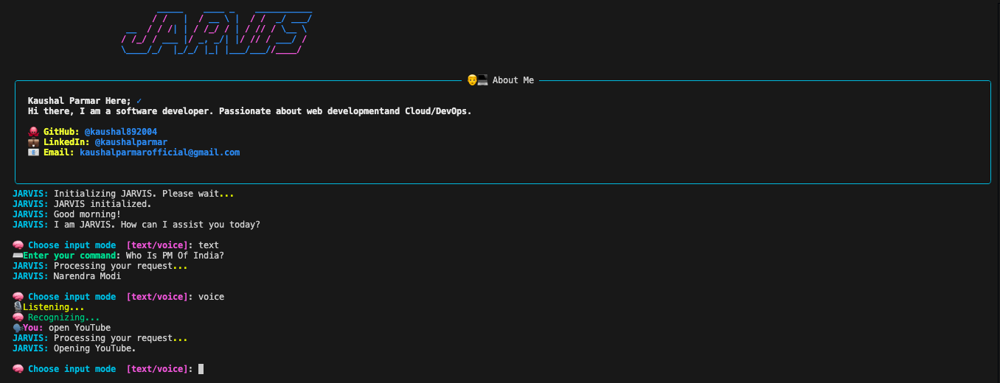

# 🤖 JARVIS: Just A Rather Very Intelligent System 🚀

 <!-- Replace with your actual screenshot path -->

**JARVIS** is a Python-based AI assistant designed for seamless interaction through voice and text via a professional, terminal-style interface. It leverages cutting-edge tools in speech recognition, text-to-speech, system automation, and artificial intelligence to create a highly responsive and extendable personal assistant experience.

---

## 🌟 Features

✅ **Voice/Text Command Processing**  
🎙 Real-time voice recognition using `speech_recognition` and `PyAudio`  
🗣 Converts responses to natural speech with `pyttsx3`

🔍 **Web & Media Integration**  
🌐 Perform Google searches using your voice or text commands  
▶️ Play YouTube videos based on voice prompts

📧 **Communication Automation**  
📩 Send emails directly from the terminal  
💬 Schedule WhatsApp messages to any contact or number

🧠 **Smart AI Integration**  
🧠 Handles unmatched or general queries using **Gemini AI**

💻 **Professional Terminal UI**  
🎨 Styled with `Rich`, `pyfiglet`, and ASCII banners for a hacker-inspired, modern terminal interface  
🖼 Great for portfolio presentation and demonstrating Python + AI skillsets

---

## 📦 Installation

### Prerequisites

- Python 3.8 or higher
- Git installed
- Recommended: use a virtual environment

### Setup Instructions

```bash
# 1. Clone the repository
git clone https://github.com/kaushal892004/Jarvis.git
cd Jarvis

# 2. Create and activate virtual environment
python -m venv venv
source venv/bin/activate  # On Windows: venv\Scripts\activate

# 3. Install required dependencies
pip install -r requirements.txt


## Usage 🚀

1. Run the Jarvis script:
   ```bash
   python main.py
   ```
```

📂 Project Structure
Jarvis/
├── assets/                # Screenshots or banners
├── jarvis/                # Core application package
│   ├── modules/           # Command handling modules
│   ├── utils/             # Utility functions (helpers, validators)
│   └── config.py          # API keys and configurations
├── main.py                # Main entry point of the application
├── requirements.txt       # All required dependencies
├── README.md              # This documentation
└── venv/                  # (Optional) Python virtual environment

```

### Made with ❤️ by [Kaushal Parmar](https://github.com/kaushal892004)
